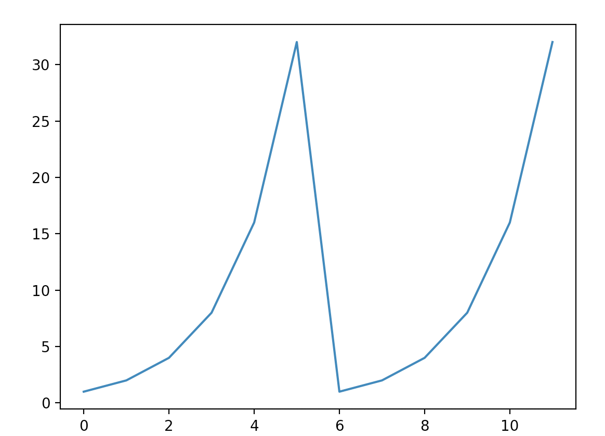

# TCP in UDP

implmentation of TCP over a UDP socket in C

## to build
` > make`

## Features

- [X] Server - Client over UDP
- [X] 3 way handshake
- [X] accept()
- [X] segmentation
- [X] ACK
- [X] slow start

Congestion window by time (a segment was lost in the middle) 
- [ ] Congestion Avoidance
- [ ] Fast retransmit
- [ ] Fast recovery
- [ ] Selective ACK

